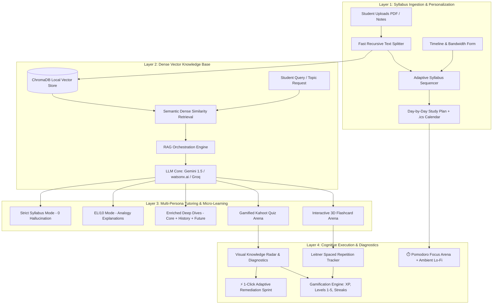

# 🧠 AI Study Buddy — Personalized Learning Agent

[](https://ibm-hackathon-qy8csbf954w9pewxnyh3se.streamlit.app/)
[](https://www.python.org/downloads/)
[](https://opensource.org/licenses/MIT)
[](#-hackathon-track-alignment)

> **IBM Hackathon 2026 Submission** — An intelligent, multi-persona AI study companion and Retrieval-Augmented Generation (RAG) agent that transforms raw syllabi and lecture notes into customized day-by-day study roadmaps, active recall quizzes, interactive 3D flashcards, focus timers, and adaptive weak-area remediation.

---

## 🌐 **Live Web Application**
👉 **[Launch AI Study Buddy Live](https://ibm-hackathon-qy8csbf954w9pewxnyh3se.streamlit.app/)**

---

## 🎯 **Hackathon Track Alignment**

### **Track 1: Student AI Track**
* **Category:** Learning Outcomes, Employability, and Student Experience.
* **Problem Solved:** Traditional education relies on one-size-fits-all curricula that fail to adapt to a student's daily bandwidth, cognitive style, or retention decay curve.
* **Solution:** **AI Study Buddy** integrates cognitive learning science (*Active Recall*, *Spaced Repetition*, *Feynman Technique*, and *Leitner Flashcard Boxes*) with a zero-hallucination RAG architecture.

---

## 🏛️ **System Architecture**



---

## ✨ **Key Features & Capabilities**

### 1. 📅 **Adaptive Syllabus Sequencer (Study Schedule Planner)**
- **Constraint-Based Optimization:** Automatically calculates daily milestone workloads based on total target days (1 to 60 days) and daily hours (0.5h to 8.0h).
- **4 Pedagogical Strategies:** *Balanced Mastery*, *Exam Cram Sprint*, *Deep Dive & Foundation*, and *Spaced Repetition Focused*.
- **1-Click Calendar Sync (.ics):** Export your entire study roadmap as an RFC 5545 `.ics` file for **Google Calendar, Apple Calendar, and Microsoft Outlook**.
- **Interactive Checklist:** Mark subtopics and days complete with instant **+50 XP** gamified rewards.

### 2. ⏱️ **Integrated Pomodoro Focus Arena**
- **Interval Timers:** Toggle between **🍅 25m Focus Block**, **⚡ 50m Deep Work Sprint**, and **☕ 5m Short Break**.
- **Visual Countdown Ring:** SVG progress dial updating smoothly every second without page reloads.
- **🎧 Synthesized Ambient Audio:** Built-in Web Audio API sound generator (*🌧️ Gentle Rain*, *☕ Coffee Shop*, *🌊 Ocean Calm*) for distraction-free focus.
- **Milestone Chimes:** Harmonic completion chime and celebration bonus points.

### 3. 💬 **Multi-Persona Cognitive AI Tutor**
- **🎓 Strict Syllabus Mode:** Zero hallucinations — strictly relies on indexed syllabus chunks and refuses out-of-scope queries with verified citations.
- **🎈 ELI10 (Explain Like I'm 10):** Translates complex mathematical proofs, algorithms, and dense concepts into everyday analogies.
- **💡 Enriched Delivery:** 3-part comprehensive breakdown:
  1. *Core Mechanics & Key Equations*
  2. *Historical Origin Story & Founding Researchers*
  3. *Future Industry Applications & Research Frontiers*
- **Click-to-Edit Questions:** Edit previous questions directly in the chat stream to branch or regenerate answers.

### 4. 🎮 **Gamified Kahoot-Style AI Quiz Arena**
- **Flexible Question Counts:** Dynamically generates anywhere from **3 to 100 multiple-choice questions** evaluated strictly against your uploaded document.
- **Instant Scorecards:** Real-time accuracy breakdown (`👑 Mastery`, `⚡ Proficient`, `⚠️ Needs Review`), correct/incorrect tallies, and in-depth conceptual explanations.
- **XP Progression & Streaks:** Earn XP per correct question, level up from Level 1 (*Novice Scholar*) to Level 5 (*Grandmaster*), and maintain daily learning streaks.

### 5. 🗂️ **Interactive AI Flashcards & Spaced Recall Arena**
- **3D Card Flip Animation:** Click or tap to flip cards in 3D space (`rotateY(180deg)`) revealing verified definitions and formulas.
- **Leitner Spaced Sorting:** Sort cards into **❌ Needs Practice** and **✅ Got It (Mastered)** piles with active progress bars.
- **🔀 Shuffle & 💾 Export:** Shuffle deck order for randomized recall drills and export the entire deck as a `.md` notes file.

### 6. 📊 **Visual Knowledge Radar & Weak-Area Diagnostics**
- **Topic-by-Topic Retention Matrix:** Automatically maps student quiz accuracy across distinct syllabus subtopics.
- **Adaptive Remediation Alert:** Isolates the student's lowest-scoring concept.
- **⚡ 1-Click Sprint Generator:** Instantly builds a targeted 1-day remediation study plan focused exclusively on mastering the weak area.

### 7. 📚 **Discipline-Adaptive Academic References**
- Automatically detects the subject domain (*Current Affairs, Pedagogy, STEM, Computer Science, Humanities*) and synthesizes verified academic sources (Google Scholar, Wikipedia, YouTube lectures, OpenCourseWare, and textbooks).

---

## 🛠️ **Technology Stack**

| Layer | Technology |
| :--- | :--- |
| **Frontend & UI** | [Streamlit](https://streamlit.io/) with Custom Glassmorphic Luminous Design System (`CSS3`) |
| **Vector Database** | [ChromaDB](https://www.trychroma.com/) (Zero-Network Semantic Vector Store) |
| **Ingestion & Text Processing** | [pypdf](https://pypdf.readthedocs.io/), Custom `FastTextSplitter` |
| **AI / LLM Orchestration** | Google Gemini API (`gemini-1.5-flash`), IBM watsonx.ai (`ibm/granite-13b-chat-v2`), Groq API |
| **Audio Synthesis** | Native Browser Web Audio API (Synthesized Ambient Soundscapes) |
| **Export Formats** | RFC 5545 iCalendar (`.ics`), Markdown (`.md`) |

---

## 🚀 **Quickstart & Local Installation**

### 1. Clone the Repository
```bash
git clone https://github.com/Abhijeet0848/IBM-hackathon.git
cd IBM-hackathon
```

### 2. Create and Activate Virtual Environment
```bash
# Windows
python -m venv venv
.\venv\Scripts\activate

# macOS / Linux
python3 -m venv venv
source venv/bin/activate
```

### 3. Install Dependencies
```bash
pip install -r requirements.txt
```

### 4. Configure API Keys (Optional)
Create a `.env` file in the root directory:
```env
GEMINI_API_KEY=your_gemini_api_key_here
# Optional IBM watsonx configuration
WATSONX_APIKEY=your_ibm_api_key
WATSONX_PROJECT_ID=your_ibm_project_id
```
*(Note: The app includes a rule-based offline synthesizer that works even without an API key!)*

### 5. Launch the Application
```bash
streamlit run app.py
```
Open your browser at `http://localhost:8501`.

---

## 📂 **Project Directory Structure**

```
IBM-hackathon/
├── app.py                      # Main Streamlit Multi-Tab Application
├── requirements.txt            # Project Dependencies
├── README.md                   # Project Documentation
├── src/
│   ├── ingestion.py            # PDF/TXT File Parser & FastTextSplitter
│   ├── study_planner.py        # Day-by-Day Sequencer & .ics Exporter
│   ├── llm_client.py           # Multi-Provider LLM Gateway (Gemini/watsonx/Groq)
│   ├── rag_engine.py           # RAG Knowledge Retriever & Multi-Persona Tutor
│   ├── quiz_evaluator.py       # Kahoot Quiz Generator & Grading Engine
│   ├── flashcard_engine.py     # 3D Interactive Flip Card Deck & Leitner Sorting
│   ├── knowledge_radar.py      # Diagnostic Retention Matrix & Weak-Area Remediation
│   ├── gamification.py         # XP System, Level Progression, Streaks & Mindset Mantras
│   ├── resource_finder.py      # Discipline-Adaptive Academic Reference Engine
│   └── styling.py              # Luminous Design System, CSS3 & HTML Component Templates
└── chroma_db/                  # Persistent ChromaDB Vector Store
```

---

## 🛡️ **Security & Privacy**
- **Zero API Key Leakage:** API credentials are authenticated through server-side environment variables and Streamlit Secrets.
- **In-Memory File Processing:** Uploaded files are parsed via `io.BytesIO` streams rather than written unsanitized to disk.
- **Input Sanitization:** All user queries and document context strings are sanitized to prevent script injection.

---

## 📄 **License**
This project is licensed under the **MIT License** — see the [LICENSE](LICENSE) file for details.
