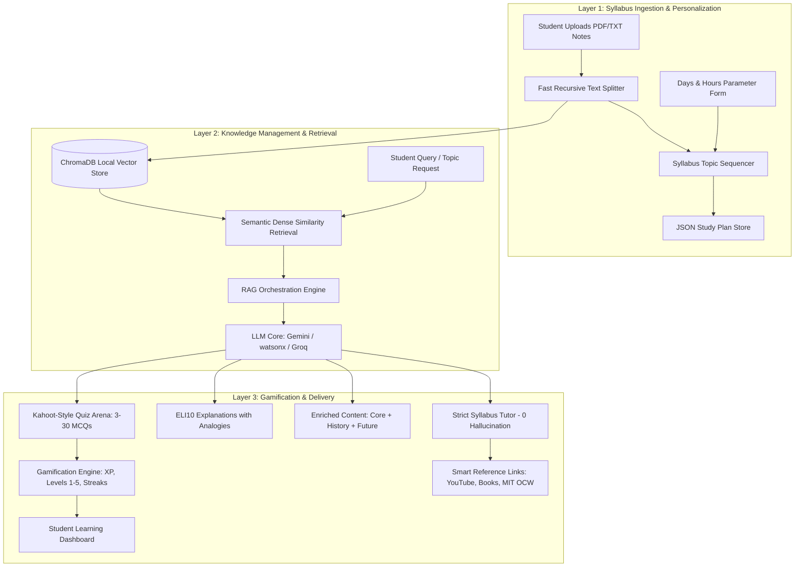

# 🧠 AI Study Buddy: Personalized Learning Agent
> **IBM Hackathon Project** — A 3-Layer Gamified Retrieval-Augmented Generation (RAG) & Small Language Model (SLLM) Architecture for Personalized Education.

---

## 📌 Overview
Traditional digital learning systems present static, one-size-fits-all content without factoring in a student's real-world time constraints or cognitive preferences. 

**AI Study Buddy** is an end-to-end intelligent learning agent that ingests raw course syllabi and lecture notes (PDF/TXT), sequences topics mathematically based on days and hours available, delivers enriched multi-persona tutoring, and reinforces memory retention through active-recall Kahoot-style quizzes and gamified XP rewards.

---

## 🏛️ System Architecture



---

## ✨ Key Features

### 1. 📅 Layer 1: Personalization & SLLM Schedule Planner
- **Constraint-Based Optimization:** Takes the student's available timeline (e.g. 7 days) and daily bandwidth (e.g. 2.0 hrs/day).
- **Dynamic Topic Extraction:** Sequences real module titles, algorithms, formulas, and definitions from uploaded notes.
- **Checkable Milestones:** Daily checkable milestones with **+50 XP** rewards per completed day.
- **📚 Smart References Popover:** Instant one-click links to **YouTube Video Lectures**, **Google Books**, **MIT OpenCourseWare**, and **Google Scholar** for each study item.

### 2. 💬 Layer 2: Knowledge Retrieval & Multi-Persona Tutoring
- **🎓 Strict Syllabus Tutor:** Answers strictly using syllabus facts with 0 hallucinations; refuses out-of-syllabus questions with *"This is not in your syllabus."*
- **🎈 ELI10 Mode:** Demystifies complex technical jargon using vivid analogies (Lego blocks, pizzas, playgrounds).
- **💡 Enriched Content Delivery:** 3-part structured breakdown:
  1. *Core Syllabus Principles*
  2. *Historical Origin Story & Notable Researchers*
  3. *Future Industry Applications & Modern Research*
- **🔍 Verified Citations:** Live citation drawer displaying the exact extracted source chunks.

### 3. 🎮 Layer 3: Gamified Kahoot-Style AI Quiz Arena
- **Custom Question Count:** Generate anywhere from **3 to 30 multiple-choice questions** on any topic or full syllabus.
- **100% Document-Grounded:** Extracts questions verbatim from your PDF text without cutting off words or sentences.
- **Live Scoring & XP Multipliers:** Instant answer validation (`🔴 [A]`, `🔷 [B]`, `🟡 [C]`, `🟢 [D]`), accuracy percentage, tier badges (`🏆 Mastery`, `🥈 Proficient`, `🥉 Developing`), and detailed answer review explanations.

### 4. 🔍 Layer 4: ChromaDB Vector Knowledge Explorer
- Inspect and debug indexed chunks, vector cosine distances, character counts, and metadata in real-time.

---

## 🛠️ Technology Stack

- **Frontend & UI:** [Streamlit](https://streamlit.io/) with Custom Glassmorphism Dark Theme (`CSS3`)
- **Vector Database:** [ChromaDB](https://www.trychroma.com/) (Persistent Local Semantic Embeddings)
- **Text Extraction & Chunking:** [pypdf](https://pypdf.readthedocs.io/), [LangChain Text Splitters](https://python.langchain.com/)
- **LLM Connectors:**
  - Google Gemini REST API (`gemini-flash-latest`, `gemini-1.5-flash`, `gemini-2.0-flash`)
  - IBM watsonx.ai Foundation Models (`ibm/granite-13b-chat-v2`)
  - Groq Cloud API (`llama-3.3-70b-versatile`)
  - High-Fidelity Local Cognitive Fallback Engine
- **Gamification:** Custom XP engine, Level progressions (Levels 1–5), study streak counter, and daily smart motivational reminders.

---

## 🚀 Quickstart Guide

### 1. Clone the Repository
```bash
git clone https://github.com/Abhijeet0848/IBM-hackathon.git
cd IBM-hackathon
```

### 2. Create and Activate Virtual Environment
```bash
# Windows
python -m venv venv
.\venv\Scripts\activate

# Mac / Linux
python3 -m venv venv
source venv/bin/activate
```

### 3. Install Dependencies
```bash
pip install -r requirements.txt
```

### 4. Configure Environment Variables
Create a `.env` file in the root directory (or copy `.env.example`):
```env
# Google Gemini API Key (Get free key from https://aistudio.google.com)
GEMINI_API_KEY=your_gemini_api_key_here

# Optional: Groq API Key
GROQ_API_KEY=your_groq_api_key_here

# Optional: IBM watsonx / Bob API Credentials
WATSONX_APIKEY=your_ibm_api_key_here
WATSONX_PROJECT_ID=your_ibm_project_id_here
WATSONX_URL=https://us-south.ml.cloud.ibm.com
```

### 5. Launch the Application
```bash
streamlit run app.py
```
Open your browser at **`http://localhost:8501`**.

---

## 👥 5-Member Team Branching Strategy

| Member | Branch Name | Module Ownership | Core Files |
|---|---|---|---|
| **Member 1** | `feature/rag-ingestion` | PDF extraction, recursive chunking & ChromaDB vector store | `src/ingestion.py`, `src/rag_engine.py` |
| **Member 2** | `feature/llm-connectors` | Multi-LLM connectors (Gemini / watsonx / Groq) & prompt engineering | `src/llm_client.py`, `src/prompts.py` |
| **Member 3** | `feature/study-scheduler` | Parameter-based study planner & syllabus topic sequencing | `src/study_planner.py` |
| **Member 4** | `feature/gamification-quiz` | Kahoot-style MCQ evaluation, XP tiers, streaks & scoring | `src/quiz_evaluator.py`, `src/gamification.py` |
| **Member 5** | `feature/ui-smart-resources` | Glassmorphism UI tokens, YouTube/Books smart links & dashboard flow | `app.py`, `src/styling.py`, `src/resource_finder.py` |

---

## 📁 Repository Structure
```text
├── app.py                     # Main Streamlit 4-Tab Web Application
├── requirements.txt           # Python Dependencies Manifest
├── .env.example               # Template Environment Configuration
├── .gitignore                 # Git Ignore Rules (Protects .env and local db)
├── README.md                  # Project Documentation
└── src/
    ├── __init__.py
    ├── ingestion.py           # Document Ingestion, PDF parser & ChromaDB vector pipeline
    ├── rag_engine.py          # RAG Query Orchestrator & Citation Manager
    ├── llm_client.py          # Multi-Provider LLM Client (Gemini, watsonx, Groq)
    ├── prompts.py             # System Prompts (Strict Tutor, ELI10, Enriched, Quiz)
    ├── study_planner.py       # SLLM Syllabus Analyzer & Daily Milestone Sequencer
    ├── quiz_evaluator.py      # Kahoot MCQ Parser, Live Grader & Score Breakdown
    ├── resource_finder.py     # YouTube, Books, MIT OCW & Scholar Links Suggester
    ├── gamification.py        # XP Engine (Levels 1-5), Streaks & Smart Reminders
    └── styling.py             # Dark Glassmorphism CSS Design System & Hero Banner
```

---

## 🏆 Hackathon Impact & Value Proposition
- **Zero-Delay Cold Start:** Instant local semantic dense indexing without external model download bottlenecks.
- **Zero-Hallucination Academic Guarantee:** Strict Tutor ensures answers never drift outside the approved syllabus.
- **Deep Conceptual & Historical Context:** Enriched delivery bridges classroom theory with real-world history and cutting-edge industry research.
- **High Retention via Gamification:** Kahoot-style recall quizzes turn passive studying into an engaging, rewarded daily habit.
